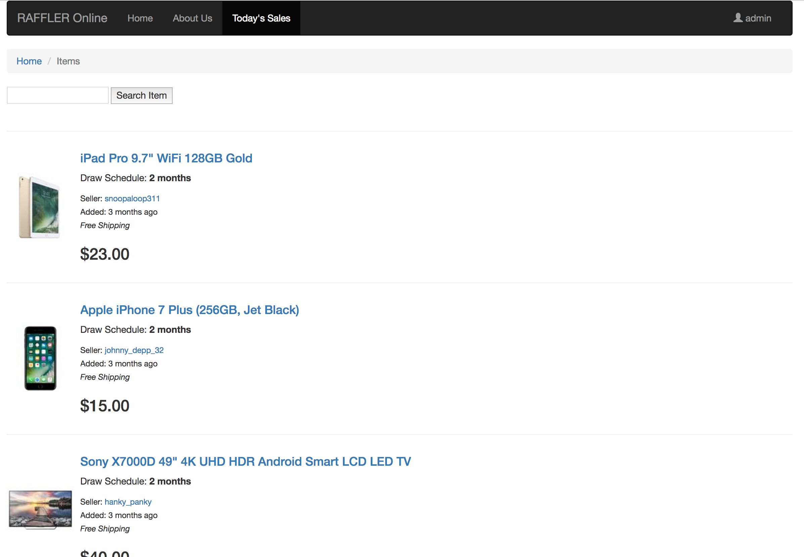
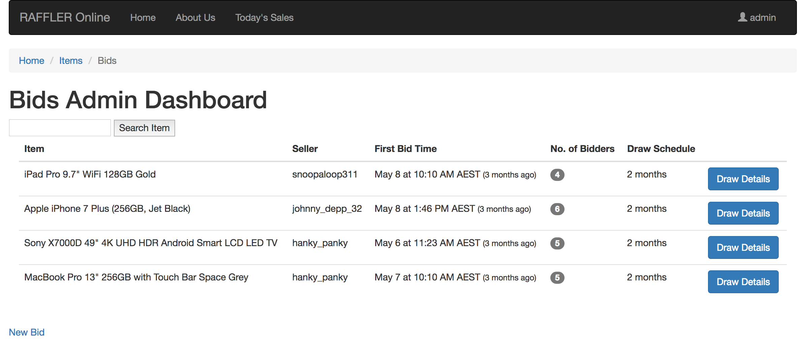

# What is Raffler?

Raffler is a marketplace where you can potentially buy something for a lot, lot less.

*For a general outline on how the system works, see this* [infographic](https://1drv.ms/p/s!AtM30fNCNt04mhfA-JqnUmBgtnfK)


### Project resources
- The live version of the project can be seen [here](http://raffler-project.herokuapp.com/)

- The development outline for this project can be found on this Trello [board](https://trello.com/b/GtGdDZ9l/raffler)

- The project ERD can be found [here](https://trello-attachments.s3.amazonaws.com/5906b11860380455da83445a/590955e657dd560677d2fa28/ce66d5d8a43be61588a0c3af39ca5241/RafflerERD.png)

- The mockup board can be found [here](https://github.com/alfredosorio/Raffler/blob/master/app/assets/images/Screen%20Shot%202017-05-15%20at%2010.16.34.png)

### Gems used in this project:
- `gem 'devise'`
- `gem 'figaro'`
- `gem 'stripe'`
- `gem "paperclip", "~> 5.0.0"`
- `gem 'aws-sdk', '~> 2.3'`
- `gem 'delayed_job_active_record'`
- `gem 'bootstrap-sass'`

### Prerequisites:

#### Local Installation:

Install dependant gems
`bundle install`

Migrate the database:
`rails db:migrate`

Migrate seeded data:
`rails db:seed`

Start background process to handle jobs in delayed_jobs table:
`rails jobs:work`


#### Live Deployment:

Migrate the database:
`heroku run rails db:migrate`

Migrate seeded data:
`heroku run rails db:seed`

Start background process to handle jobs in delayed_jobs table:
`heroku run rails jobs:work`

### Screenshots

The Today's Sales Page <br />


The Admin Dashboard <br />



### Built with:

- [Devise](https://github.com/plataformatec/devise) - for user authentication and session management
- [Figaro](https://github.com/laserlemon/figaro) - to store and manage ENV variables in a YAML file
- [Stripe](https://stripe.com/) - to manage payments
- [Paperclip](https://github.com/thoughtbot/paperclip) - to manage image uploads and S3 integration
- [AWS SDK](https://github.com/aws/aws-sdk-ruby) - for managing S3 bucket assets
- [DJ ActiveRecord](https://github.com/collectiveidea/delayed_job) - to implement a way to offset times jobs are run
- ActionMailer - manages SMTP and mailer tasks. Used in conjunction with [MailGun](https://www.mailgun.com/) for transactional email management.
- Bootstrap - front-end templating


# Project Details

Login Details:

admin@raffler.com : password

Role: Admin

### Technical notes
This project is built around a 2-sided marketplace structure. Users can play the role of a buyer(bidder) or a seller. There is also an admin user that has all the site's functionality exposed only for that particular user.

It has been uploaded to Heroku, with a Postgresql backend and images are automatically uploaded to AWS S3 to address Heroku's shortfalls.

The Delayed Job (DJ) gem has been used to delay emails for automated bids.
It can be seen on the Bids controller where it delays the task for 15 seconds:

```
# for presentation, set to 15s. actual = (run_at: (@item.created_at + 7.days))
    UserMailer.delay(run_at: 15.seconds.from_now).send_winner_email(@item, @winner)
    UserMailer.delay(run_at: 15.seconds.from_now).send_seller_email(@item, @winner, @draw_total)
    redirect_to bid_path(@item.id), notice: "Emails have been sent to: #{@item.seller.user.email} and #{@winner.user.email}"
```

In a practical environment, the delay will run within 7 days as per the requirements of the project (where each item will be automatically drawn 7 days from its creation date.)

### Choosing a winner
The conceptual way a bidder is chosen is based on an article from [Dartmouth University](https://www.dartmouth.edu/~chance/course/topics/winning_number.html) where it states:

> IT takes just seven ordinary, imperfect shuffles to mix a deck of cards
thoroughly, researchers have found. Fewer are not enough and more do not
significantly improve the mixing.

I implemented this idea in the app by using ruby's `shuffle` method:

```
7.times { shuffled = bidders.shuffle }
winner = shuffled.first
```

#### Set Timezone to Melbourne (UTC + 1000)

In application.rb, I added:
`config.time_zone = "Melbourne"`

The application overrides the standard UTC Timezone to cater for accurate AEST +1000 time. I chose to do this so that time attributes in the project i.e.: `created_at` and `updated_at` are referenced in a local time. It also helped during testing where I could simply reference the local system time.

# Notable Challenges
#### Converting the current app from SQLite3 to Postgresql database, then deploying to Heroku.

Errors were encountered when running `$ heroku run rails db:migrate`

```
heroku FATAL: permission denied for database "postgres"
PG::UndefinedTable: ERROR: relation "sellers" does not exist

```

#### Troubleshooting approach:
**1.) Google search for error:**

PG::UndefinedTable: ERROR: relation "sellers" does not exist

**2.) Stackoverflow solutions pointed to two possibilities:**

- Issue with Postgres permissions in terms of table creation OR
- Issue with migration files being out of order

**3.) Run tests:**

I found that a few tables were already being created during migration i.e.: Users, Items `<ERROR OCCURS HERE>` -- so no issue with permissions.

I then found that migration files (in order) created:
1. Users
2. Items
3. Bids
4. Sellers
5. Profiles

**4.) SOLUTION: Switched order of create_sellers_rb migration to be created after devise_create_users (rename generated date/time)**

The heroku migration was completed without any errors at this stage and the app was working as required.


#### ActionMailer error when deployed to production

Error encountered during bid placement. Screenshot [here](https://trello-attachments.s3.amazonaws.com/5906b11860380455da83445a/5913feaac391da9adbeaa8a4/2c56de35b1abacd33a7b5e88c530ba38/Heroku_Problem.png)

#### Troubleshooting approach:

**1.) Ran 'heroku logs' in terminal. Found the following clue:***

```
2017-05-11T05:41:07.705881+00:00 app[web.1]: F, [2017-05-11T05:41:07.705839 #4] FATAL -- : [420a3324-2717-47f2-9fc7-8ac6ef084b7d] Errno::ECONNREFUSED (Connection refused - connect(2) for "localhost" port 25)
```

**2.) Checked Stripe log to see if payment was successful.***

Log indicated `"Payment succeeded"`

**3.) Checked Gmail account to see if email was received.**

Email was not received.

**4.) Found production.rb file was missing ActionMailer with MailGun configs as per below:**

```
Configure ActionMailer with MailGun
config.action_mailer.delivery_method = :smtp
config.action_mailer.smtp_settings = {
:authentication => :plain,
:address => "smtp.mailgun.org",
:port => 587,
:domain => "sandbox297954caf0144383a8e35855a9618348.mailgun.org",
:user_name => "postmaster@sandbox297954caf0144383a8e35855a9618348.mailgun.org",
:password => ENV["MAILGUN_PASSWORD"]
}
```

**5.) SOLUTION: After a simple copy/paste, VOILA! Error is solved and emails are sent successfully.**

Further research, technical notes and approaches have been covered on the Trello board (link above).
